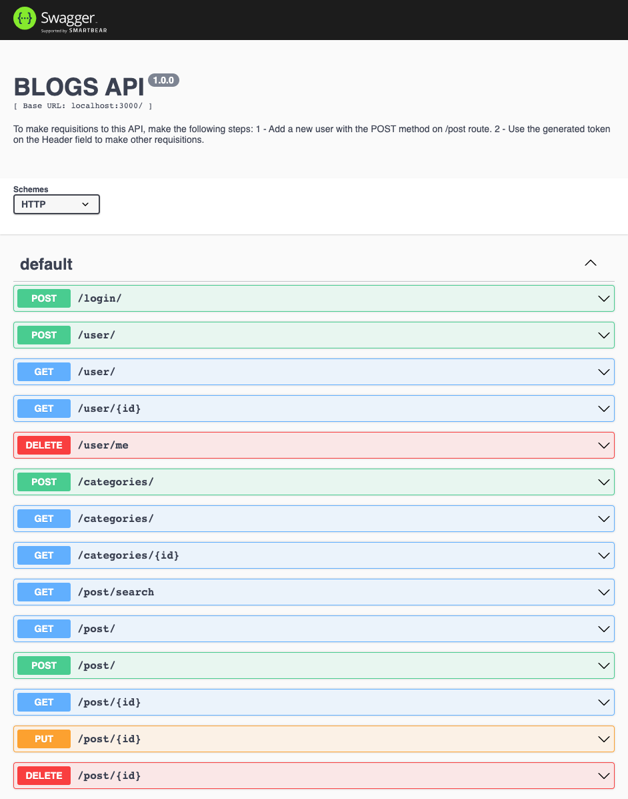

# Blogs API

## About:

BlogsAPI was developed during the Trybe Course, which consists of creating a CRUD RESTful API made with Sequelize ORM capable of creating, reading, updating and deleting posts, categories, posts and usersfor a Blog Post.

To facilitate the maintenance and readability of the code, the MSC architecture was used to separate each function from the code.

#
## Technologies:

- NodeJS
- Sequelize ORM
- JavaScript ES6+
- MSC Architecture (Model-Service-Controller)

#
## Methodologies:

- Kanban
- Scrum

#
## Routes:

### Login
- Make a Login with email and password (POST /login)

### User
- List all users (GET /user)
- Register a new user (POST /user)
- Search an user by id (GET /user/:id)
- Delete a logged user (DELETE /user/me)

### Categories
- List all categories (GET /categories)
- Register a new category (POST /categories)
- Search an category by id (GET /categories/:id)

### Post
- List all blog posts (GET /post)
- Register a new blog post (POST /post)
- Search a blog post by id (GET /post/:id)
- Update a blog post by id (PUT /post/:id)
- Delete a blog post by id (DELETE /post/:id)

#
## How to install the application:

To download the code:

```
git clone git@github.com:eduardomuchak/25-blogs-api.git
```

Enter the project root folder:

```
cd 25-blogs-api
```
#
## Running the aplication Locally VS Docker (recommended: Docker):

## Locally:

### Requirements:
- NodeJs Version: >=16.0.0

### Steps:

Rename the .env.example file to only .env and set the enviroment variables:

- `MYSQL_HOST = localhost`
- `MYSQL_USER = Your_MYSQL_User`
- `MYSQL_PASSWORD = Your_MYSQL_Password`
- `MYSQL_DATABASE = db`
- `PORT=3000`

Install the dependencies:

```
  npm install
```
#
## Running with Docker:

### Requirements:
- Docker-Compose Version: >=1.29

### Steps:

Run node and db containers with this command:

```bash
  docker-compose up -d
```

Run the following code to attach a container:

```bash
  docker exec -it store_manager bash
```

Rename the .env.example file to only .env and set the enviroment variables:

- `MYSQL_HOST = localhost`
- `MYSQL_USER = Your_MYSQL_User`
- `MYSQL_PASSWORD = Your_MYSQL_Password`
- `MYSQL_DATABASE = db`
- `PORT=3000`

Install the dependencies (inside a container):
```
  npm install
```

To create the database
```bash
  npm run prestart
```

To populate the database
```bash
  npm run seed
```
#
## The documentation can be viewed using Swagger via route:
```bash
  http://localhost:3000/doc
```

<p align="center">
  
</p>

